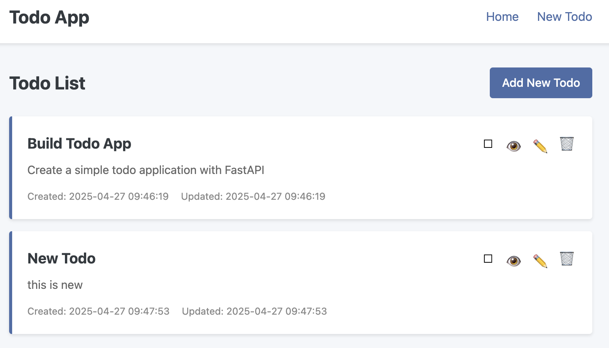
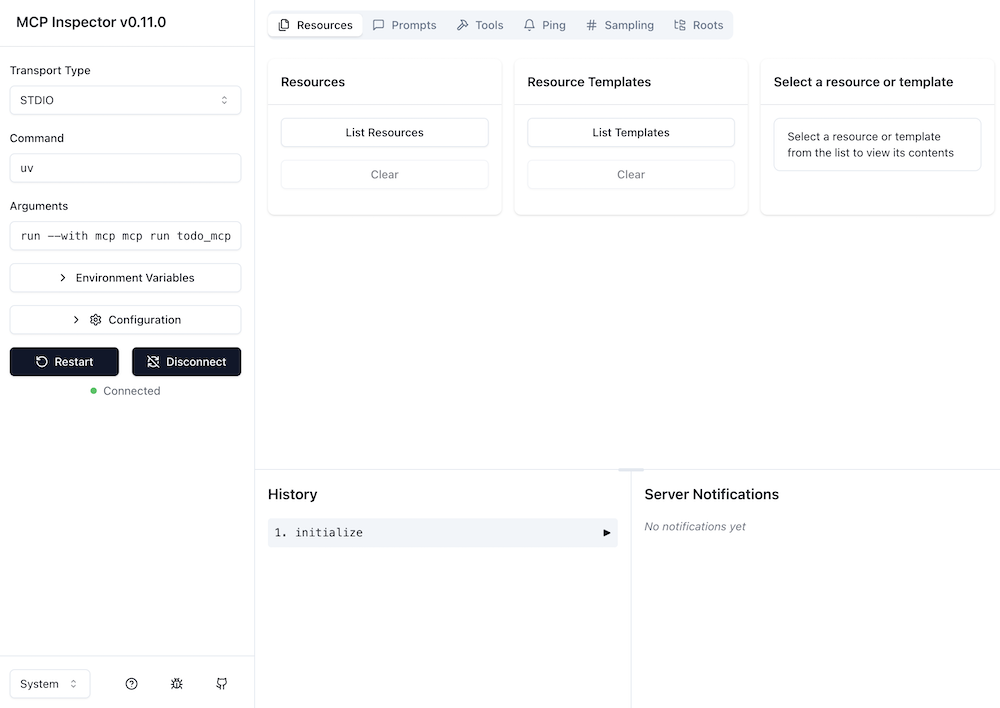
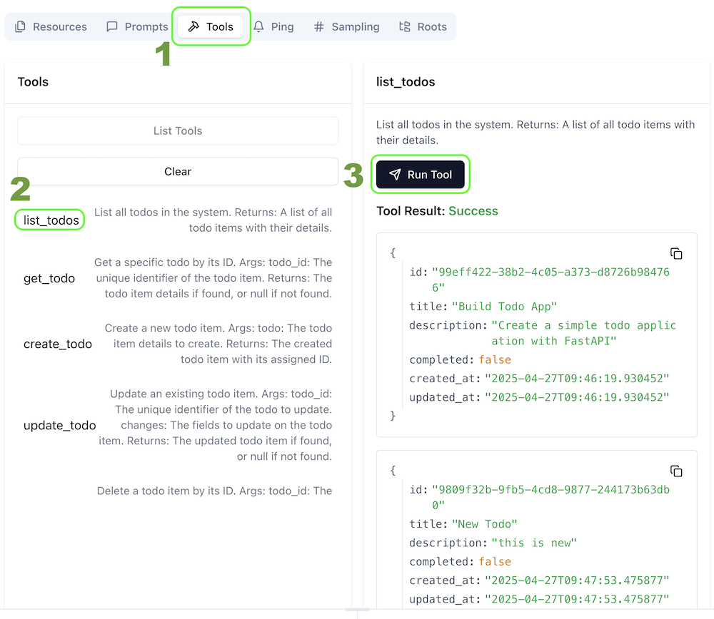

# Todo App Plus MCP

A Todo application with a FastAPI backend, a Flask UI frontend, and a Model Context Protocol (MCP) server.

## Project Structure

- `todo_api/` - FastAPI backend
- `todo_ui/` - Flask UI frontend
- `todo_mcp/` - Model Context Protocol server
- `todo_chat/` - Chat interface for interacting with the Todo app
- `todo_data.sample.json` - Sample data that will be used to create todo_data.json on first run

## Overview

This project demonstrates how to build a simple Todo application with three different interfaces:

1. **REST API** (FastAPI) - For programmatic access
2. **Web UI** (Flask) - For human interaction via a browser
3. **MCP Server** - For AI assistant interaction


## Project Setup

This is an educational application that uses `uv` for dependency management with all dependencies consolidated in pyproject.toml.

1. Install all dependencies using uv:
   ```
   # Install dependencies from pyproject.toml in development mode
   uv pip install -e .
   ```

## Running the Application

The application consists of three main components that can be run independently or together:

1. The Todo API (Backend) - Serves data via REST endpoints
2. The Todo UI (Frontend) - Provides a web interface
3. The Todo MCP Server - Allows AI assistants to interact with the Todo app
4. The Todo Chat CLI (Chat interface for interacting with the Todo app)

### Running the Todo API (Backend)

The API is built with FastAPI and needs to be started first as the UI depends on it.

```bash
# Start the API server on port 8000
uv run uvicorn todo_api.main:app --reload --port 8000
```

Once running, the API will be available at:
- http://localhost:8000

The API also provides interactive documentation at:
- Swagger UI: http://localhost:8000/docs
- ReDoc: http://localhost:8000/redoc

### Running the Todo UI (Frontend)

After starting the API server, run the UI server in a separate terminal:

```bash
# Start the UI server on port 8001
uv run python -m todo_ui.app
```

Once running, the web interface will be available at:
- http://localhost:8001



### Running the Todo MCP Server

The Model Context Protocol (MCP) server allows AI assistants like Claude to interact with the Todo application by exposing MCP tools and prompts.

```bash
# Run the MCP server
uv run python -m todo_mcp.server
```

## Data Storage

The application uses a JSON file for data storage:
- On first run, the application will check for the existence of `todo_data.json`
- If `todo_data.json` doesn't exist, it will create one based on `todo_data.sample.json`
- Your personal todo data is stored in `todo_data.json` which is ignored by Git to prevent accidentally committing personal data

## API Endpoints

- `GET /todos`: Get all todos
- `GET /todos/{todo_id}`: Get a specific todo
- `POST /todos`: Create a new todo
- `PUT /todos/{todo_id}`: Update a todo
- `DELETE /todos/{todo_id}`: Delete a todo

## Model Context Protocol (MCP) Server

The MCP server implements the [Model Context Protocol](https://modelcontextprotocol.io/specification/2025-03-26), allowing AI assistants like Claude to directly interact with the Todo application.

### MCP Tools

The MCP server provides the following tools:

- `list_todos`: List all todos in the system
- `get_todo`: Get a specific todo by ID
- `create_todo`: Create a new todo item
- `update_todo`: Update an existing todo item
- `delete_todo`: Delete a todo item by ID
- `get_todo_stats`: Get statistics about todos in the system

### MCP Prompts

The MCP server also provides prompts for more complex analysis:

- `todo_analysis`: Analyze the current state of todos and provide insights

### Testing with the MCP Inspector

The easiest way to test your MCP server is using the built-in MCP Inspector tool:

```bash

# Start the MCP Inspector
❯ uv run mcp dev todo_mcp/server.py
Need to install the following packages:
@modelcontextprotocol/inspector@0.11.0
Ok to proceed? (y) y

Starting MCP inspector...
⚙️ Proxy server listening on port 6277
🔍 MCP Inspector is up and running at http://127.0.0.1:6274 🚀
```

You can now open http://127.0.0.1:6274 in your browser to access the MCP Inspector.
After clicking the **Connect** button you will see this

And you can now test the tools and prompts. For example, you can call the `list_todos` tool to see all todos. 
1. Click on the **Tools** tab
2. Select the `list_todos` tool
3. Click on the **Run tool** button


The MCP Inspector provides an interactive UI where you can:
- View and test all available tools
- Call tools with custom parameters
- Explore available prompts
- See the server history and responses

### Using with Claude AI

To use this MCP server with Claude:

1. Install the MCP CLI tool: `pip install mcp-cli`
2. Install the server: `mcp install todo_mcp/server.py --name "Todo MCP Server"`
3. The server will now be available as a tool for Claude in the Claude Desktop app or Claude web interface

## What is Model Context Protocol (MCP)?

MCP is a standardized protocol that enables AI assistants like Claude to interact with external systems and tools. Unlike traditional APIs that are designed for developers to use in code, MCP is designed to be used directly by AI models.

With MCP, AI assistants can:
- Discover what tools are available
- Call these tools to perform actions or retrieve information
- Access specialized prompts for complex analyses

For more information about MCP and how it's implemented in this project, see the [MCP documentation](./docs/mcp_documentation.md).

## Project Architecture

The Todo App Plus MCP project demonstrates a multi-interface architecture:

```
┌─────────────┐     ┌───────────┐     ┌──────────────┐
│             │     │           │     │              │
│ Human User  ├─────┤  Web UI   ├─────┤              │
│             │HTTP │ (Flask)   │HTTP │              │
└─────────────┘     └───────────┘     │              │
                                      │              │
┌─────────────┐     ┌───────────┐     │  Todo API    │     ┌──────────┐
│             │     │           │     │  (FastAPI)   │     │          │
│ Developer   ├─────┤  REST API ├─────┤              ├─────┤  JSON    │
│             │HTTP │ Endpoints │     │              │     │  Database│
└─────────────┘     └───────────┘     │              │     │          │
                                      │              │     └──────────┘
┌─────────────┐     ┌───────────┐     │              │
│             │     │           │     │              │
│ AI Assistant├─────┤ MCP Server├─────┤              │
│ (Claude)    │MCP  │           │     │              │
└─────────────┘     └───────────┘     └──────────────┘
```

This architecture allows for interaction through multiple interfaces while maintaining a single shared data source.

## Contributing

This is an educational project meant to demonstrate how to integrate MCP with existing applications. Contributions are welcome to improve the codebase, add features, or enhance documentation.

## License

This project is released under the MIT License.